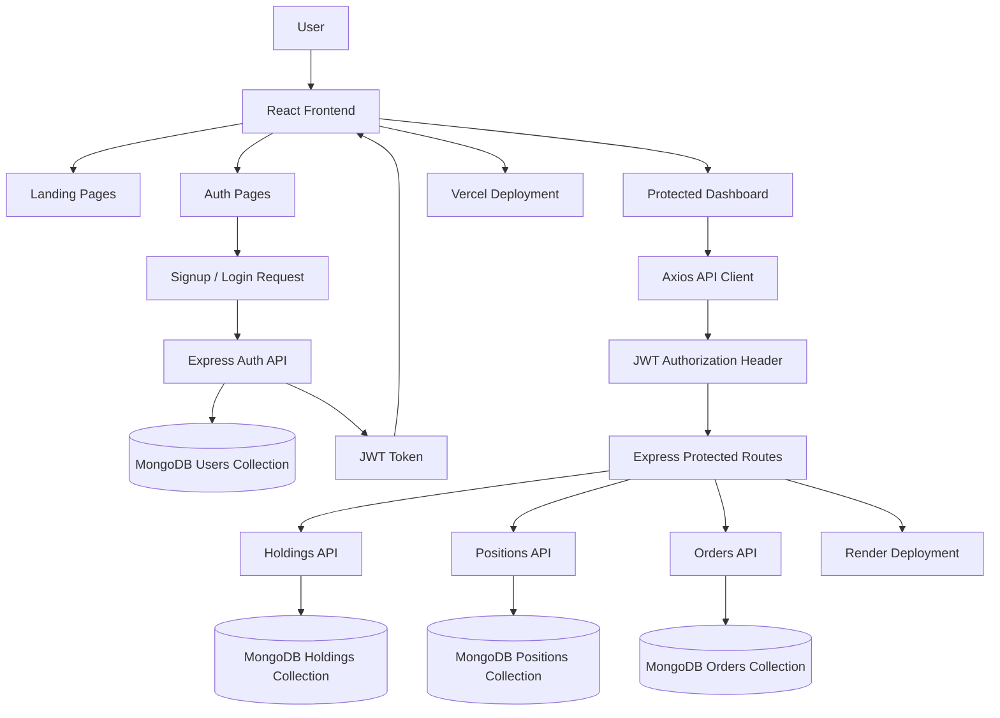
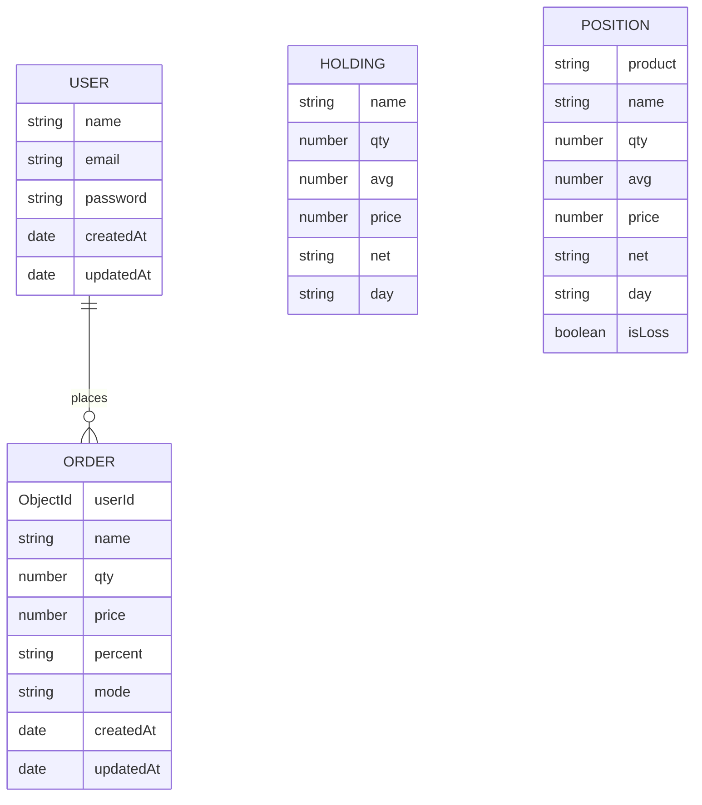
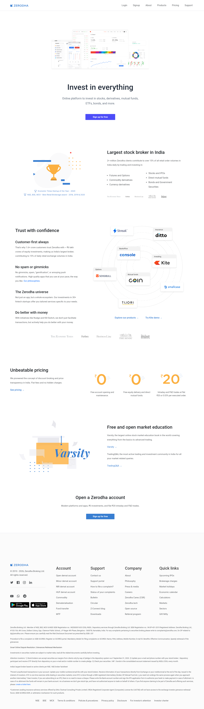
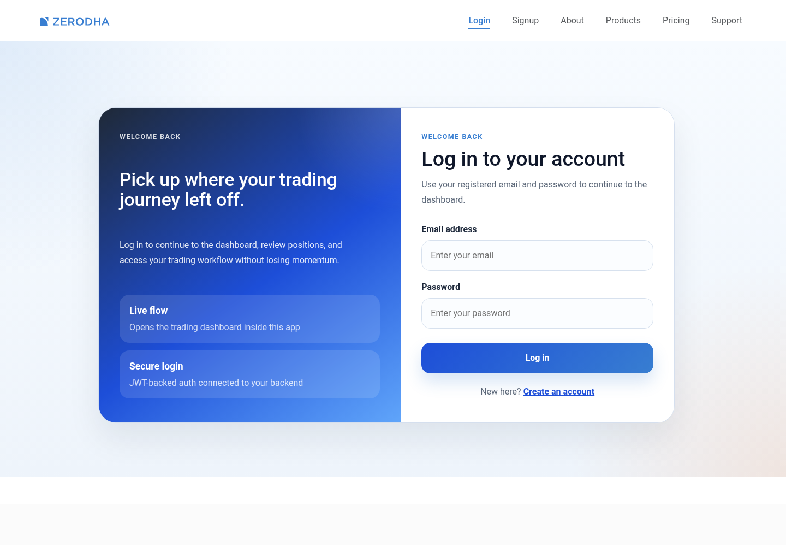
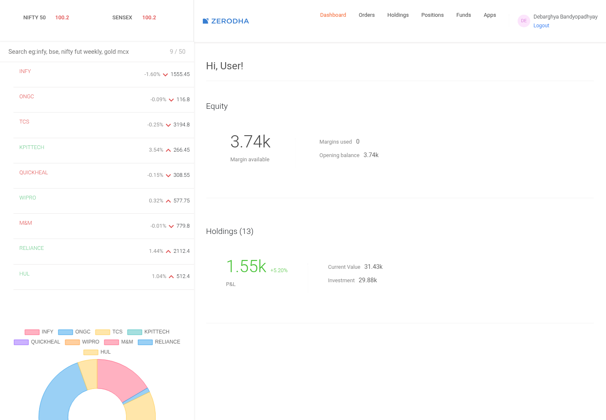
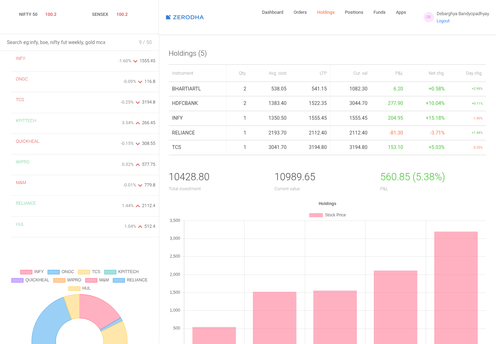
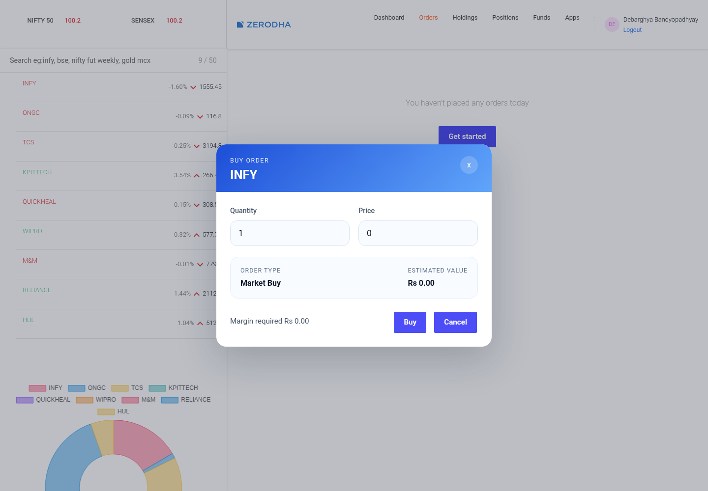
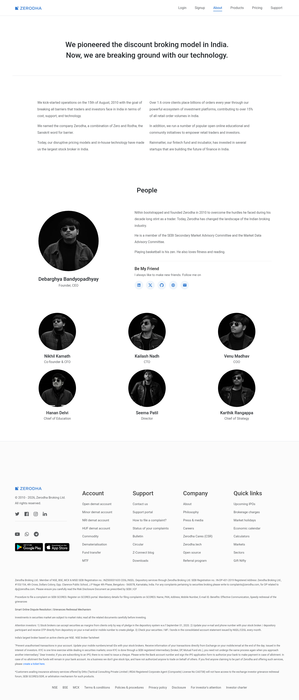

# 📈 Zerodha Clone

A full-stack stock trading platform clone with a responsive landing site, secure authentication, and a protected dashboard for holdings, positions, and order placement.

## 🚀 Live Demo

[https://zerodha.debarghya.org/](https://zerodha.debarghya.org/)

## 💡 Motivation

The goal of this project was to rebuild a modern trading platform experience inspired by Zerodha while learning how a real full-stack product is structured, secured, deployed, and optimized.

I wanted to go beyond a static landing page and create a complete application flow with authentication, protected dashboard routes, portfolio-style data, order placement, responsive UI, and production deployment.

## ✨ Features

- 📱 Responsive Zerodha-inspired landing pages
- 🔐 User signup and login with JWT authentication
- 🛡️ Protected dashboard access for authenticated users
- 📊 Dashboard overview with portfolio summary
- 💼 Holdings and positions views
- 👀 Watchlist with stock price movement indicators
- 🛒 Buy order window with quantity, price, and estimated value
- 🗄️ Order creation API connected to MongoDB
- 🚪 Automatic logout/redirection for expired or invalid tokens
- 🧭 Responsive navigation for landing pages and dashboard
- ⚡ Optimized About page images using lightweight WebP assets
- 🚀 Production deployment support for frontend and backend

## 🏗️ Architecture

This project follows a full-stack client-server architecture with a separate React frontend and Express backend.

```text
User
  ↓
React Frontend
  ↓
API Requests with JWT Token
  ↓
Express.js Backend
  ↓
Mongoose Models
  ↓
MongoDB Database
```

### Visual Flow



- 🖥️ **Frontend:** Handles routing, page rendering, authentication state, dashboard UI, and API calls.
- 🔐 **Auth Layer:** Stores the JWT token in localStorage and attaches it to protected dashboard API requests.
- 🧾 **Backend API:** Manages signup, login, protected holdings/positions routes, and order creation.
- 🗄️ **Database Layer:** Uses Mongoose schemas and models to interact with MongoDB collections.
- 🚀 **Deployment Layer:** Frontend is deployed separately from the backend, with environment variables connecting both services.

## 📁 Folder Structure

```text
zerodha_clone/
├── backend/
│   ├── config/
│   │   └── db.js
│   ├── controllers/
│   │   └── authController.js
│   ├── middleware/
│   │   └── authMiddleware.js
│   ├── model/
│   │   ├── HoldingsModel.js
│   │   ├── OrdersModel.js
│   │   ├── PositionsModel.js
│   │   └── UserModel.js
│   ├── routes/
│   │   └── authRoutes.js
│   ├── schemas/
│   │   ├── HoldingsSchema.js
│   │   ├── OrdersSchema.js
│   │   └── PositionsSchema.js
│   ├── server.js
│   ├── package.json
│   └── .env.example
│
├── frontend/
│   ├── public/
│   │   └── Assets/
│   ├── src/
│   │   ├── api/
│   │   ├── auth/
│   │   ├── dashboard/
│   │   ├── landing_page/
│   │   ├── index.css
│   │   └── index.js
│   ├── package.json
│   ├── vercel.json
│   └── .env.example
│
├── screenshots/
├── README.md
├── render.yaml
└── .gitignore
```

## 🗄️ Database Design

The backend uses MongoDB with Mongoose models and schemas. The main collections are `users`, `orders`, `holdings`, and `positions`.

### Collections Overview

```text
User
├── name
├── email
├── password
├── createdAt
└── updatedAt

Order
├── userId
├── name
├── qty
├── price
├── percent
├── mode
├── createdAt
└── updatedAt

Holding
├── name
├── qty
├── avg
├── price
├── net
└── day

Position
├── product
├── name
├── qty
├── avg
├── price
├── net
├── day
└── isLoss
```

### Relationship Flow



- 👤 **User Collection:** Stores registered users with hashed passwords.
- 🧾 **Orders Collection:** Stores buy/sell orders created by authenticated users.
- 💼 **Holdings Collection:** Stores stock holdings data shown in the dashboard.
- 📊 **Positions Collection:** Stores active/previous trading position data.

## 🖼️ Screenshots

### Home Page


### Login Page


### Dashboard


### Holdings Page


### Buy Order Window


### About Page


## 🧰 Tech Stack

- ⚛️ **Frontend:** React.js, React Router, CSS, Bootstrap-style layout utilities
- 🎨 **UI & Icons:** Material UI Icons, Font Awesome
- 📊 **Charts:** Chart.js, React Chart.js 2
- 🟢 **Backend:** Node.js, Express.js
- 🗄️ **Database:** MongoDB, Mongoose
- 🔐 **Authentication:** JWT, bcryptjs
- 🌐 **API Communication:** Fetch API, Axios
- 🚀 **Deployment:** Vercel for frontend, Render for backend
- ⚙️ **Environment Management:** dotenv, `.env.example` files
- 🧪 **Testing Setup:** React Testing Library, Jest

## ⚙️ Installation

Follow these steps to run the project locally.

### 1. Clone the Repository

```bash
git clone https://github.com/debarghya131/zerodha_clone.git
cd zerodha_clone
```

### 2. Install Backend Dependencies

```bash
cd backend
npm install
```

### 3. Install Frontend Dependencies

```bash
cd ../frontend
npm install
```

### 4. Start the Backend Server

```bash
cd backend
npm run dev
```

The backend runs on:

```text
http://localhost:5000
```

### 5. Start the Frontend App

```bash
cd frontend
npm start
```

The frontend runs on:

```text
http://localhost:3000
```

## 🔑 Environment Variables

Create `.env` files using the provided `.env.example` files.

### Backend `.env`

```env
MONGO_URL=your_mongodb_connection_string
JWT_SECRET=your_long_random_jwt_secret
PORT=5000
CORS_ORIGIN=http://localhost:3000
```

### Frontend `.env`

```env
REACT_APP_API_BASE_URL=http://localhost:5000
```

- 🔒 Keep real `.env` files private.
- ✅ Commit only `.env.example` files to GitHub.
- 🌐 In production, add these values through Render and Vercel environment settings.

## 🧩 Challenges Faced

- 🔐 Implementing secure authentication while keeping the dashboard protected from unauthenticated access.
- 🌐 Connecting a separately deployed frontend and backend without CORS issues.
- 🗄️ Structuring MongoDB models for users, orders, holdings, and positions.
- 📱 Making both the landing pages and dashboard responsive across screen sizes.
- ⚡ Improving page speed by reducing heavy image assets.
- 🚀 Managing production deployment across Vercel and Render with separate environment variables.

## ✅ Solutions Implemented

- 🔐 Added JWT-based authentication with password hashing using `bcryptjs`.
- 🛡️ Created protected backend routes using authentication middleware.
- 🌐 Configured CORS with environment-based allowed origins.
- 🧾 Added order validation before saving order data to MongoDB.
- 📱 Improved responsive layouts for navigation, dashboard, and About page sections.
- ⚡ Converted large About page PNG images into optimized WebP assets.
- 🔑 Used `.env.example` files to document required environment variables without exposing secrets.
- 🚀 Added `render.yaml` to support backend deployment configuration on Render.

## 🧪 Testing

- ✅ Verified production frontend builds using `npm run build`.
- ✅ Tested authentication flow for signup, login, logout, and protected dashboard access.
- ✅ Checked dashboard API calls for holdings, positions, and order placement.
- ✅ Confirmed invalid/expired tokens redirect users back to the login page.
- ✅ Added README screenshots after rendering the app locally.
- 🧪 Testing setup includes React Testing Library and Jest for frontend tests.

## ⚡ Optimization

- 🖼️ Replaced heavy About page PNG images with lightweight WebP assets.
- 📉 Reduced referenced About page image weight from several megabytes to a much smaller optimized set.
- 💤 Added lazy loading and async decoding for About page team images.
- 📐 Added fixed image dimensions to reduce layout shift.
- 📦 Used production build output for optimized frontend deployment.
- 🌍 Kept frontend and backend deployment separate for clearer scaling and configuration.

## 🔒 Security

- 🔐 Passwords are hashed with `bcryptjs` before being stored.
- 🪪 JWT tokens are used for authenticated dashboard requests.
- 🛡️ Protected API routes require a valid `Authorization: Bearer <token>` header.
- 🚫 Sensitive environment variables are excluded from Git using `.gitignore`.
- ✅ `.env.example` files document required variables without exposing real secrets.
- 🌐 CORS is controlled through the `CORS_ORIGIN` environment variable.
- 🧾 Order payloads are validated on the backend before being saved.

## 🔮 Future Improvements

- 📈 Add real-time market price updates using WebSockets.
- 🧾 Display saved orders in the Orders dashboard page.
- 👤 Add user-specific holdings and positions.
- 💳 Add funds, wallet, and transaction history features.
- 🔍 Add search and filtering for watchlist, holdings, and orders.
- 📊 Improve analytics with richer charts and portfolio insights.
- 🧪 Add more backend and frontend test coverage.
- 🔐 Add refresh tokens and stronger session management.
- 🌙 Add dark mode for the dashboard.
- 📱 Improve mobile dashboard experience further.

## 📚 Learnings

- 🏗️ Learned how to structure a full-stack MERN-style project with separate frontend and backend apps.
- 🔐 Practiced implementing JWT authentication and protected routes.
- 🗄️ Improved understanding of MongoDB, Mongoose schemas, and model relationships.
- 🌐 Learned how frontend and backend services communicate through API calls.
- 🚀 Practiced deploying frontend and backend separately using Vercel and Render.
- 🔑 Learned the importance of environment variables and secret management.
- ⚡ Improved performance awareness by optimizing large image assets.
- 📱 Practiced building responsive UI for both landing pages and dashboard screens.

## 👨‍💻 Author Details

**Debarghya Bandyopadhyay**

### 🤝 Be My Friend

I always like to make new friends. Follow me on:

[](https://www.linkedin.com/in/debarghya-bandyopadhyay-953b02400?utm_source=share_via&utm_content=profile&utm_medium=member_android)
[](https://x.com/debarghya131)
[](https://github.com/debarghya131)
[](https://portfolio.debarghya.org)
[](mailto:debarghyabandyopadhyay191@gmail.com)

📧 **Email:** [debarghyabandyopadhyay191@gmail.com](mailto:debarghyabandyopadhyay191@gmail.com)
